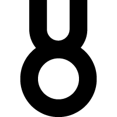

<!DOCTYPE html>
<html>

<head>
    <meta charset="UTF-8">
    <meta name="author" content="Victor Chartin">
    <meta name="description" content="Urban Oxygen Festival is a French music festival that takes places every year in Paris.">
    <meta name="keywords" content="festival, festival 2021, music festival, paris, festival france">
    <meta name="viewport" content="width=device-width, initial-scale=1.0">
    <link href="css/style.css" rel="stylesheet">
    <link
        href="https://fonts.googleapis.com/css2?family=Montserrat:ital,wght@0,100;0,200;0,300;0,400;0,500;0,600;0,700;0,800;0,900;1,100;1,200;1,300;1,400;1,500;1,600;1,700;1,800;1,900&display=swap"
        rel="stylesheet">
    
    <title>URBAN OXYGEN FESTIVAL</title>
</head>

<body>
    

        
        
15-16 SEPT. 2021

        <a href="#"><i class="fas fa-caret-right"></i> Home</a>
        <a href="schedule.html">Schedule</a>
        <a href="gallery.html">Gallery</a>
        <a href="contact.html">Contact</a>
    

    <header class="header">
        <h1>URBAN OXYGEN</h1>
        
FESTIVAL

        <a href="#about" class="arrow"><i class="fas fa-chevron-down"></i></a>
    </header>
    

        <svg xmlns="http://www.w3.org/2000/svg" viewBox="0 0 1440 320">
            <path fill="#080808" fill-opacity="1"
                d="M0,256L0,256L36.9,256L36.9,192L73.8,192L73.8,96L110.8,96L110.8,192L147.7,192L147.7,128L184.6,128L184.6,320L221.5,320L221.5,96L258.5,96L258.5,256L295.4,256L295.4,160L332.3,160L332.3,160L369.2,160L369.2,192L406.2,192L406.2,320L443.1,320L443.1,192L480,192L480,64L516.9,64L516.9,256L553.8,256L553.8,224L590.8,224L590.8,128L627.7,128L627.7,96L664.6,96L664.6,96L701.5,96L701.5,128L738.5,128L738.5,288L775.4,288L775.4,32L812.3,32L812.3,96L849.2,96L849.2,224L886.2,224L886.2,288L923.1,288L923.1,320L960,320L960,128L996.9,128L996.9,160L1033.8,160L1033.8,224L1070.8,224L1070.8,64L1107.7,64L1107.7,64L1144.6,64L1144.6,320L1181.5,320L1181.5,192L1218.5,192L1218.5,256L1255.4,256L1255.4,288L1292.3,288L1292.3,288L1329.2,288L1329.2,320L1366.2,320L1366.2,32L1403.1,32L1403.1,128L1440,128L1440,0L1403.1,0L1403.1,0L1366.2,0L1366.2,0L1329.2,0L1329.2,0L1292.3,0L1292.3,0L1255.4,0L1255.4,0L1218.5,0L1218.5,0L1181.5,0L1181.5,0L1144.6,0L1144.6,0L1107.7,0L1107.7,0L1070.8,0L1070.8,0L1033.8,0L1033.8,0L996.9,0L996.9,0L960,0L960,0L923.1,0L923.1,0L886.2,0L886.2,0L849.2,0L849.2,0L812.3,0L812.3,0L775.4,0L775.4,0L738.5,0L738.5,0L701.5,0L701.5,0L664.6,0L664.6,0L627.7,0L627.7,0L590.8,0L590.8,0L553.8,0L553.8,0L516.9,0L516.9,0L480,0L480,0L443.1,0L443.1,0L406.2,0L406.2,0L369.2,0L369.2,0L332.3,0L332.3,0L295.4,0L295.4,0L258.5,0L258.5,0L221.5,0L221.5,0L184.6,0L184.6,0L147.7,0L147.7,0L110.8,0L110.8,0L73.8,0L73.8,0L36.9,0L36.9,0L0,0L0,0Z">
            </path>
        </svg>
    

    

        
        <h2>ABOUT US</h2>
        

            
Urban Oxygen Festival is an all-genre electronic music festival held every year from September 15th to
                16th in Paris, France.

            
The event has been branded "France's International Festival" by local and international media, and some
                of the music acts playing at the festival have included Basement Jaxx, Little Dragon, Justice, The
                Jacka,
                Nick Warren, Baauer and Annie Mac.

            
The festival features international DJs from a range of genres including Hip Hop, Soul and Drum & Bass.
            

            
The event is free for both artists and audience. 

            
The name of the festival is derived from the typical oxygen tanks carried by the medical staff of the
                hospital situated next to the festival location. 

            
The Urban Oxygen Festival has grown into one of the most famous festivals in Europe, with more than
                30,000 attendees in 2020. 

            
In 2020, the festival added the Electric Zone as a second stage, bringing a bigger line-up of House,
                Trance and Techno.

        

        

            <h2>LOCATION</h2>
            <ul>
                <li>151 Rue de Sèvres</li>
                <li>Paris, France</li>
            </ul>
        

    

    <footer class="footerlanding">
        
&#169; 2021 Urban Oxygen Festival | All rights reserved.

        <a href="https://www.google.com/"><i class="fab fa-facebook"></i></a>
        <a href="https://www.twitter.com/"><i class="fab fa-twitter"></i></a>
        <a href="https://www.youtube.com/"><i class="fab fa-youtube"></i></a>
    </footer>
</body>

</html>